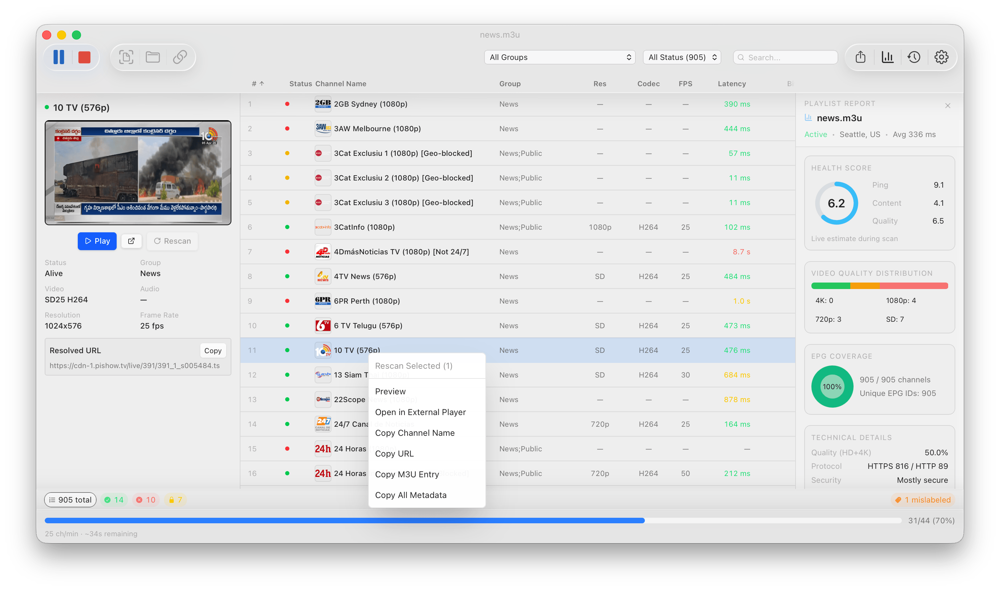

<p align="center">
  
</p>

<h1 align="center">IPTV Checker</h1>

<p align="center">
  A fast desktop app for validating IPTV playlists.<br>
  Built with Tauri v2 — runs on macOS, Windows, and Linux.
</p>

<p align="center">
  
</p>

<h3 align="center">Download</h3>

<table align="center">
  <tr>
    <td align="center" width="220">
      <a href="https://github.com/kristofferR/IPTVChecker/releases/download/v1.5.3/IPTV.Checker_1.5.3_mac_arm.dmg">
        <br>
        <strong>Download for macOS</strong><br>
        <sub>Apple Silicon &middot; .dmg</sub>
      </a>
    </td>
    <td align="center" width="220">
      <a href="https://github.com/kristofferR/IPTVChecker/releases/download/v1.5.3/IPTV.Checker_1.5.3_win_x64_setup.exe">
        <br>
        <strong>Download for Windows</strong><br>
        <sub>64-bit installer &middot; .exe</sub>
      </a>
    </td>
    <td align="center" width="220">
      <a href="https://github.com/kristofferR/IPTVChecker/releases/download/v1.5.3/IPTV.Checker_1.5.3_lin_x64.AppImage">
        <br>
        <strong>Download for Linux</strong><br>
        <sub>AppImage &middot; x64</sub>
      </a>
    </td>
  </tr>
</table>

<p align="center">
  <sub>
    Intel Mac, Windows ARM, Linux ARM, <code>.deb</code>/<code>.rpm</code>, or Windows portable?
    <a href="https://github.com/kristofferR/IPTVChecker/releases/latest">See all files →</a>
  </sub>
  <br />
  <sub>
    Homebrew for macOS/Linux and other package managers are mentioned further down.
  </sub>
</p>

---

## Features

### Load any playlist

Open M3U files from disk or URL, connect to Xtream Codes or Stalker portal accounts, or batch-load an entire folder of playlists. A sample playlist from [iptv-org](https://github.com/iptv-org/iptv) is included to get started immediately.

### See what's actually working

Scans every channel and tells you what's alive, dead, geoblocked, DRM-protected, or audio-only. Uses ffmpeg to capture stream thumbnails and detect codec, resolution, FPS, and bitrate. Flags label mismatches and duplicates automatically.

Results stream in live with an ETA and throughput counter. When the scan finishes, a health report panel slides in with per-group scoring. Pause and resume at any time, or compare results across scan history.

Supports HTTP/HLS, RTSP, and RTMP streams. Route checks through a proxy if needed.

### Browse, filter, and export

Click any channel to see its thumbnail, preview it in the built-in player, or open the lightbox to browse screenshots with the arrow keys. Filter by group, status, or regex search. Double-click a channel to play it in VLC, IINA, or whatever you have installed.

Export results as CSV, M3U (alive only, split by group, or renamed), or a full JSON scan log. Export everything, just alive channels, or your current selection.

### Lightweight and fast

Liquid Glass vibrancy on macOS, platform menus, keyboard shortcuts, dark/light/system theme, and desktop notifications when scans finish. Handles playlists with thousands of channels without breaking a sweat.

## Keyboard Shortcuts

- `Arrow Up / Down` moves the channel selection so you can step through results quickly.
- `Space` opens or closes the screenshot lightbox for the selected channel.
- `S` starts a scan when idle, or stops the current scan.
- `Cmd/Ctrl + /` opens the full shortcuts dialog in the app.

## Install

### Homebrew

Tap repo: [kristofferR/homebrew-tap](https://github.com/kristofferR/homebrew-tap)

Homebrew uses the same cask token on macOS and Linux:

```bash
brew tap kristofferR/tap
brew install iptv-checker
```

On macOS, the cask installs `IPTV Checker.app` into `/Applications`.
If it is already there, use:

```bash
brew install --adopt iptv-checker
```

### All platforms

The buttons above link to the default installer for each OS. Every architecture and package format is attached to each [GitHub release](https://github.com/kristofferR/IPTVChecker/releases/latest):

| Platform | Architecture | Files |
|----------|-------------|-------|
| macOS | Apple Silicon / Intel | `.dmg` |
| Windows | x64 / ARM | `.exe` installer or portable `.zip` |
| Linux | x64 / ARM | `.AppImage`, `.deb`, `.rpm` |

## Building from source

### Prerequisites

- [Rust](https://rustup.rs/) (latest stable)
- [Bun](https://bun.sh/) (JavaScript runtime and package manager)
- [ffmpeg + ffprobe](https://ffmpeg.org/) — optional but recommended for thumbnails and codec detection

## Getting Started

```bash
# Clone the repo
git clone https://github.com/kristofferR/IPTVChecker.git
cd IPTVChecker

# Install frontend dependencies
bun install

# (Optional) Download ffmpeg/ffprobe binaries for your platform
bun run setup:ffmpeg

# Run in development mode
bun tauri dev
```

## Building

```bash
# Production build (creates platform-specific installer)
bun tauri build
```

## Backend Benchmark Harness

Deterministic local scan/check throughput benchmark (mock local HTTP stream server):

```bash
# Runs Rust backend benchmark binary
bun run perf:backend-scan -- --channels 2000 --concurrency 16 --timeout-secs 2.0 --payload-kb 600
```

Outputs JSON with:
- `time_to_first_result_ms`
- `throughput_channels_per_sec`
- `total_elapsed_ms`
- status buckets (`alive`, `drm`, `dead`, `geoblocked`, `errors`)

## Project Structure

```
src/                    Frontend (React + TypeScript)
├── components/         UI components (Toolbar, ChannelTable, FilterBar, etc.)
├── hooks/              React hooks (useScan, useSettings, useScreenshot)
└── lib/                Types, Tauri IPC wrappers, formatting, sort/filter logic

src-tauri/src/          Backend (Rust)
├── engine/             Core logic: parser, checker, ffmpeg, proxy, resume, disk
├── commands/           Tauri IPC commands: playlist, scan, export, settings
├── models/             Data types: Channel, ChannelResult, AppSettings, etc.
├── state.rs            App state management
└── error.rs            Error types
```

## Tech Stack

| Layer | Technology |
|-------|-----------|
| Framework | [Tauri v2](https://v2.tauri.app/) |
| Backend | Rust (tokio, reqwest, serde) |
| Frontend | React 19, TypeScript, Vite 7 |
| Styling | Tailwind CSS v4 |
| Table | [@tanstack/react-virtual](https://tanstack.com/virtual) |
| Icons | [lucide-react](https://lucide.dev/) |

## License

[MIT](LICENSE)
